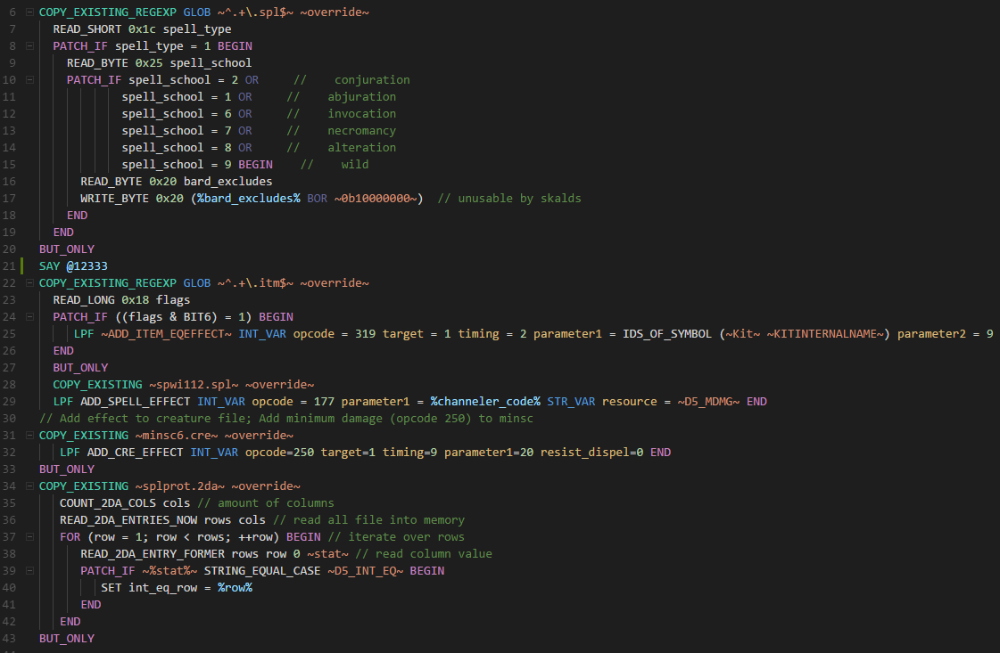

# WeiDU syntax highlighting README

Syntax highlighting for WeiDU code (.tp2, .d, .2da, .tra) for Visual Studio Code.

## Features

## Requirements

VS Code

## Installation

Clone to .vscode/extensions folder (default location for Windows is %userprofile%/.vscode/extensions).
- Folder may need to be named 'weidu'.
- Requires restart of VS Code.
- Changes to settings locally require Ctrl-Shift-P >Reload Window.

TODO: Make available from VS Code extensions.

## Extension Settings

None for now.

## Known Issues

- There are WeiDU functions not highlighted
- Highlighting has been selected more based on colors from Dark+ than for proper syntax type, i.e. translation @2 is set to variable.other.less, %variable% is set to entity.other.attribute-name
- TODO: Determine which functions should be highlighted and not

## Release Notes

### 0.0.1

Initial release. Rudimentary highlighting based on Dark+.

-----------------------------------------------------------------------------------------------------------

